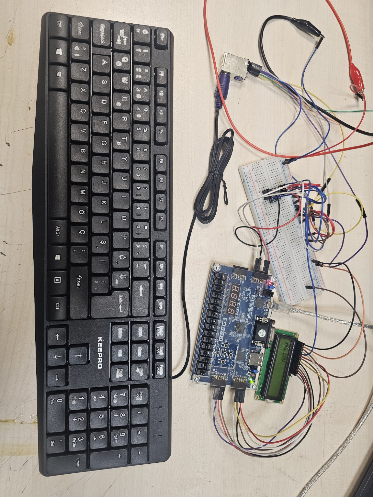
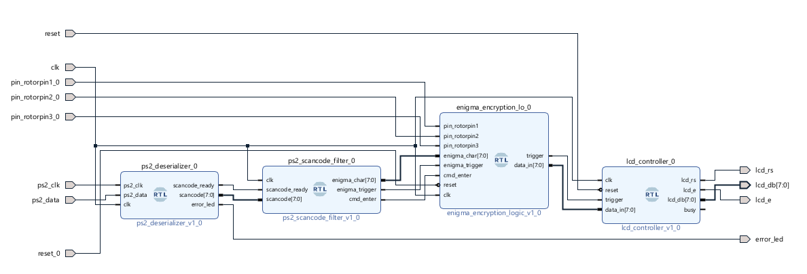
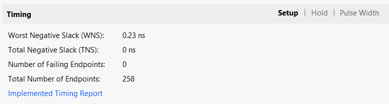
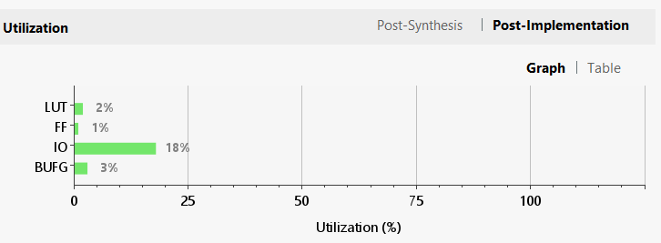

[README.md](https://github.com/user-attachments/files/32443528/README.md)
# FPGA Enigma Machine

A VHDL implementation of an Enigma-style rotor cipher on the **Digilent Basys 3**, developed for **EEE102 Digital Logic Design at Bilkent University**. The system accepts letters from a PS/2 keyboard, processes them through a plugboard, three rotors, and a reflector, and displays the resulting text on a **1602A LCD**.

The design is divided into four synchronous VHDL modules for PS/2 reception, scancode filtering, rotor-based transformation, and LCD control.

The same hardware performs encryption and decryption: resetting the rotor positions and entering the ciphertext with the same rotor selection recovers the original letters.

## Features

- PS/2 input with synchronized clock/data sampling, frame validation, and odd-parity checking.
- A–Z scancode decoding and key-release filtering.
- Six selectable rotor orders using three onboard switches.
- Fixed plugboard and reflector, forward/inverse rotor mappings, and modulo-26 position offsets.
- Rotor stepping before each letter, including middle-rotor double stepping.
- A nine-state encryption controller that spreads the transformation across clock cycles.
- An 8-bit LCD interface with initialization delays and a one-character pending buffer.
- Separate controls for resetting the cipher and clearing/reinitializing the display.

## Architecture

All four modules run from the board's **100 MHz clock**. Data moves between modules using character/scancode buses and one-cycle trigger pulses.

| Module | Responsibility |
| --- | --- |
| `ps2_deserializer.vhd` | Samples PS/2 frames, checks start/stop bits and odd parity, and produces valid scancodes. |
| `ps2_scancode_filter.vhd` | Suppresses release sequences, maps letters to IDs 0–25, and signals Enter separately. |
| `enigma_encryption_logic.vhd` | Steps the rotors, applies the cipher transformation, and converts the result to uppercase ASCII. |
| `lcd_controller.vhd` | Initializes the display and sends characters or the second-line command with timed enable pulses. |

Each letter passes through the plugboard, the three forward rotor mappings, the reflector, the three inverse mappings in reverse order, and the plugboard again. Rotor offsets change the mapping for successive letters. Enter bypasses the cipher and does not advance the rotors.

## How it works

### Letter representation and rotor mapping

The keyboard filter represents letters as integers: **A = 0, B = 1, …, Z = 25**. Each rotor is a lookup table containing a permutation of these 26 values. Rotation is represented by an offset rather than physically shifting the table.

For input $x$, rotor offset $r$, and wiring table $W$, the forward mapping is:

$$
R_r(x) = \left(W[(x+r)\bmod 26]-r\right)\bmod 26
$$

Adding $r$ selects the contact in the rotated rotor's coordinate system; subtracting $r$ converts the output back. Modulo 26 keeps the result between 0 and 25. For example, rotor 1 has $W[1]=10$, so input A ($x=0$) at offset $r=1$ maps to $(10-1)\bmod 26=9$, or J, **for that rotor alone**.

On the return path, the same equation uses the inverse wiring table $W^{-1}$, defined by $W^{-1}[W[x]]=x$. The final letter ID $y$ becomes uppercase ASCII through $y+65$.

### Stepping before each letter

Let $r_1,r_2,r_3$ be the current offsets of the fast, middle, and slow rotor slots, and $n_1,n_2$ the notch values of the rotors selected for the first two slots. Each letter uses these updated offsets:

$$
\begin{aligned}
r'_1 &= (r_1+1)\bmod 26 \\
r'_2 &= \left(r_2+\mathbf{1}[(r_1=n_1)\lor(r_2=n_2)]\right)\bmod 26 \\
r'_3 &= \left(r_3+\mathbf{1}[r_2=n_2]\right)\bmod 26
\end{aligned}
$$

Here $\mathbf{1}[\text{condition}]$ is 1 when the condition is true and 0 otherwise. All conditions use the **old offsets**, before any rotor moves. The fast rotor always steps; the middle rotor steps when either it or the fast rotor is at its notch; the slow rotor steps when the middle rotor is at its notch. This allows the middle rotor to step on consecutive letters. The implemented notch values for rotor types 1, 2, and 3 are **11, 17, and 8**. Enter causes no stepping.

### Why the same circuit decrypts

For a fixed set of rotor offsets, let $F$ represent the complete forward rotor path, $P$ the plugboard, and $U$ the reflector. One character's transformation is:

$$
E = P\circ F^{-1}\circ U\circ F\circ P
$$

Composition is read right to left. The plugboard swaps letter pairs, so $P(P(x))=x$; the reflector also pairs letters, so $U(U(x))=x$. The inverse rotor path undoes the forward path. Consequently, **at the same rotor offsets**:

$$
E(E(x))=x
$$

The offsets change between letters, so decrypting a message requires resetting the rotors and reproducing the same selection and stepping sequence. Feeding ciphertext back without resetting does not reproduce those states.

### Execution in hardware

The encryption FSM latches the selected rotor tables and computes the next offsets when it accepts a letter. It then evaluates one rotor or reflector stage per clock cycle, applies the final plugboard mapping, and pulses the LCD trigger. This divides the lookup/arithmetic path across cycles. The LCD controller independently handles the much slower display timing and initialization sequence.

## Hardware

- Digilent Basys 3, targeting `xc7a35tcpg236-1`.
- PS/2 keyboard and connector.
- Bidirectional 5 V / 3.3 V logic-level converter for PS/2 clock and data.
- 1602A LCD with an 8-bit parallel interface.
- Breadboard, jumper wires, and a suitable 5 V supply.

The keyboard's clock and data pass through the level converter before reaching the FPGA. Connect all grounds together. The LCD is used in write-only mode with **R/W tied to ground**. Its RS, E, and data lines are driven by the FPGA; the LCD module must accept 3.3 V logic levels when powered from 5 V. Set LCD contrast using its V0 connection.

Pin assignments from xdcfile.xdc

| Signal | FPGA package pin | Connection |
| --- | --- | --- |
| `clk` | W5 | Onboard 100 MHz oscillator |
| `reset_0` | T17 | Cipher reset button |
| `reset` | U18 | LCD reset button |
| `pin_rotorpin1_0` | V17 | SW0 |
| `pin_rotorpin2_0` | V16 | SW1 |
| `pin_rotorpin3_0` | W16 | SW2 |
| `error_led` | U16 | LED0 |
| `ps2_clk` | J1 | Level-shifted keyboard clock |
| `ps2_data` | L2 | Level-shifted keyboard data |
| `lcd_rs` | A14 | LCD pin 4, RS |
| `lcd_e` | A16 | LCD pin 6, E |
| `lcd_db[0]` | B15 | LCD pin 7, DB0 |
| `lcd_db[1]` | B16 | LCD pin 8, DB1 |
| `lcd_db[2]` | A15 | LCD pin 9, DB2 |
| `lcd_db[3]` | A17 | LCD pin 10, DB3 |
| `lcd_db[4]` | K17 | LCD pin 11, DB4 |
| `lcd_db[5]` | M18 | LCD pin 12, DB5 |
| `lcd_db[6]` | N17 | LCD pin 13, DB6 |
| `lcd_db[7]` | P18 | LCD pin 14, DB7 |

## Controls and operation

| Control | Action |
| --- | --- |
| Letter keys A–Z | Process a letter and display the uppercase result. |
| Enter | Move the LCD cursor to the start of the second line. |
| Cipher reset, T17 (`reset_0`) | Reset all three rotor offsets to zero. |
| LCD reset, U18 (`reset`) | Clear and reinitialize the LCD without resetting the rotors. |
| SW0, SW1, SW2 | Select the rotor order. |
| LED0 | Indicate a PS/2 framing or parity error; the next valid start bit clears it. |

The selection bits below are ordered **SW0, SW1, SW2**, matching `pin_rotorpin1_0`, `pin_rotorpin2_0`, and `pin_rotorpin3_0`. Rotor order is listed from the first/fast rotor encountered on the forward path.

| SW0 SW1 SW2 | Rotor order |
| --- | --- |
| 000 | 1, 2, 3 |
| 001 | 1, 3, 2 |
| 010 | 2, 1, 3 |
| 011 | 2, 3, 1 |
| 100 | 3, 1, 2 |
| 101 | 3, 2, 1 |
| 110 or 111 | Default: 1, 2, 3 |

**To encrypt:** select a rotor order, press and release both reset buttons, wait for LCD initialization, and type the message using A–Z. Record the displayed letters.

**To decrypt:** keep the same rotor order, reset the cipher to restore zero offsets, clear the display if desired, and type the recorded ciphertext. Keep the switches unchanged during each message.

## Build with Vivado

### Repository layout

| Directory | Contents |
| --- | --- |
| `src/` | The four core VHDL modules. |
| `constraints/` | `xdcfile.xdc`, defining pin assignments and the system clock. |
| `vivado/` | `check1_block_design.bd` and `check1_block_design_wrapper.vhd`. |
| `images/` | Assembled-system photograph, block design, timing, and utilization screenshots. |

**Project tool version: Vivado 2025.2.** The supplied block design and generated wrapper both record this version.

1. Create an RTL project targeting `xc7a35tcpg236-1` (Basys 3).
2. Add the four VHDL modules in `src/` as design sources.
3. Add `vivado/check1_block_design.bd` and `constraints/xdcfile.xdc` to the project as the block design and constraints, respectively.
4. Open the block design, resolve/refresh module references if requested, and validate the design.
5. Generate the block design's output products. Add the supplied `vivado/check1_block_design_wrapper.vhd` and set `check1_block_design_wrapper` as the top module. Alternatively, generate a new HDL wrapper from the block design; use only one wrapper definition.
6. Run synthesis, implementation, and bitstream generation. Review timing and design-rule reports.
7. Connect the Basys 3 and program it through Hardware Manager.

The constraints define a 10 ns system-clock period. The LCD timing constants also assume 100 MHz.

This design was synthesized, implemented, programmed, and tested on a physical Digilent Basys 3 during the EEE102 project using the design files included in this repository. It was also demonstrated and evaluated as part of the course. A fresh reconstruction from the repository has not yet been performed since the course concluded.

## Implementation results

The complete system was tested with a physical PS/2 keyboard and 1602A LCD. Multiple rotor selections were tested on hardware: the same input word, **ENIGMA**, produced different ciphertext with different rotor orders. Rotor offsets were reset before each test so that the results could be compared from the same starting positions.

The supplied implementation screenshots show:

| Metric | Result |
| --- | --- |
| Worst setup slack (WNS) | +0.230 ns |
| Total negative setup slack (TNS) | 0 ns |
| Failing setup endpoints | 0 |
| LUT utilization | Approximately 2% |
| Flip-flop utilization | Approximately 1% |
| I/O utilization | Approximately 18% |
| BUFG utilization | Approximately 3% |

Resource percentages are rounded values from the graph. The timing screenshot covers setup analysis; it does not show hold, pulse-width, or unconstrained-path checks.

## Scope and limitations

- This is an educational Enigma-style implementation with a fixed plugboard, zero reset positions, and project-specific notch values. It is not presented as a historically exact replica or modern secure encryption.
- Spaces, digits, and punctuation are not supported. Holding a letter key can produce repeated characters through keyboard auto-repeat.
- The filter ignores the `E0` prefix rather than tracking complete extended-key sequences.
- Enter always selects the beginning of the second LCD line. Automatic line wrapping and scrolling are not implemented by the controller.
- The LCD pending buffer holds one character; it is not a general input queue. The PS/2 receiver has no incomplete-frame timeout.
